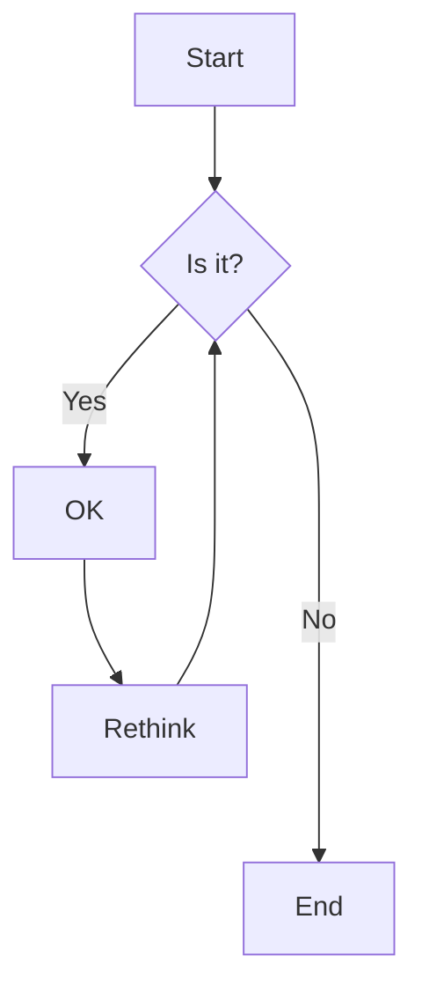

# all-religions-in-10-minutes-logical-version

This is an Islamic response to the relatively fair [Christian video](https://www.youtube.com/watch?v=FTDXlIw8i20)

The idea is that, we will bring the [law of thought](https://en.wikipedia.org/wiki/Law_of_thought) accepted by the majority of logicians and informed reasonable people, and see if we can order the religions accordingly and try to prove that it is actually that only Islam should be picked from all the other religions if the person wants to be reasonable and compatible with the law of thought.

The plan is to pick the rules of the law of thought one by one, and see which basic tenets of each religion violate this rule, and how Islam is actually the only fully logical religion, and we will try to reuse the contents of the same mentioned video as much as possible just to emphasize how biased that video is, not only biased toward Christianity, but also biased toward the main stream narrative of making all religions relative and subjective. The video concentrate on choice instead of concentrating on evidence, which is why we think it does not reperesent the Islamic faith right, and this is the video which will fix the issue and show how regilions are sorted in the minds of informed Muslims.

## ** DISCLAIMER **

While Islam does not mention the law of thought specifically, it is important to understand that using minds, reflection and reasoning are very frequent theme in the Quran, so I am not suggesting that this approach of using the law of thought is coming from Islam itself, but I am just trying to target the people who believe in the law of thought (intenionally or intuitively) to let them see that Islam is their only choice if they want to be true to their faith, in other words, I personally believe that these rules are valuable as a way to communicate with non-Muslims, but inside Islam and between Muslims we prefer to only use the vocabulary and rules mentioned specifically in the Quran, because we strive to follow pure divine guidance and avoid tainting it with fallable human thinking.

For example, in the Quran there is a solution for a very famous logical problem, which is about probability and importance. To understand it, let's imagine we have a news about something very dangerous but it is coming from a doubtful source, then what is the right decision to be taken? Which decision is the best if everything else is equal? Should we enact according to the news, should we ignore it because it is doubtful, or should we do something else?

The answer to this problem can be deducted from the Quranic verse 49:6, which states that the believers should not enact on the bases of the doubtful news nor should they ignore it, but they should work towards being sure about the news first, so for Muslims, enhancing low probability is better than enacting on high importance. So, in Islam, being just is more important than being safe, and this same rule is actually violated by many non-Muslims who believe in one of the follow proverbs: 

"It's better to be safe than sorry." - This saying emphasizes the value of taking precautions and making safe choices to avoid regrets or unfortunate consequences.

"Pride goes before a fall." - This proverb suggests that arrogance or excessive pride can lead to one's downfall, and it encourages humility.

"He who hesitates is lost." - This saying underscores the idea that failing to take action or make a decision in a timely manner can result in missed opportunities or negative outcomes.

"A stitch in time saves nine." - This proverb highlights the importance of addressing a problem or issue promptly to prevent it from becoming more serious and requiring more effort to fix later.

"Don't cut off your nose to spite your face." - This saying advises against making decisions out of anger or spite that harm oneself in the process.

This is an example of how logical rules can be extracted from the Quran text without relying on fallable human thinking and deeply embedded false beliefs.

## Content

